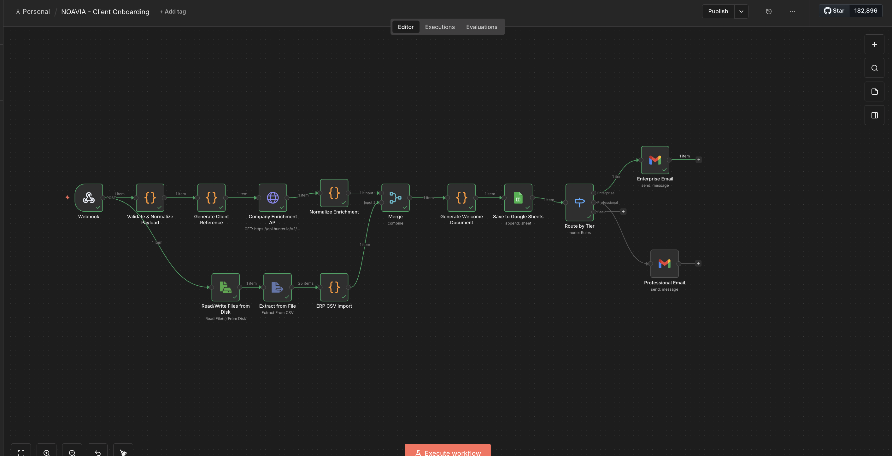
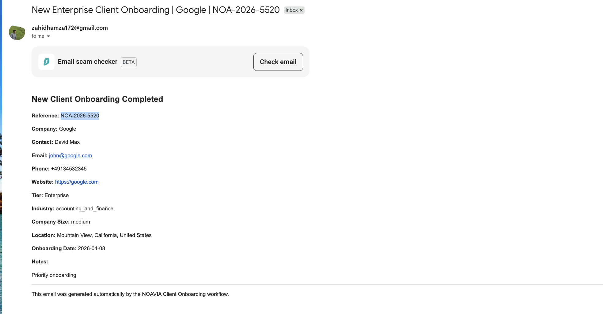
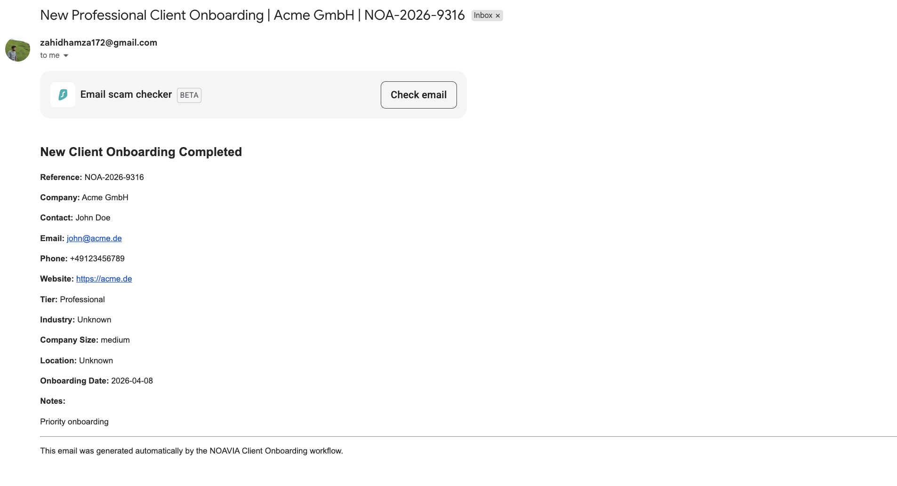
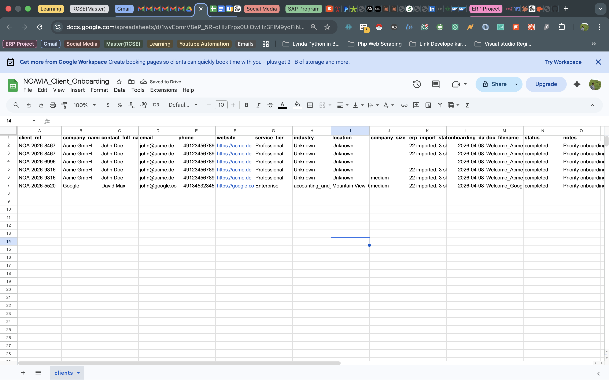

# NOAVIA Client Onboarding Automation

**Candidate:** Hamza Zahid Butt  
**Position:** Full-Stack Automation Engineer — Intern / Working Student  
**Submitted:** April 2026

---

## Proof of Working System

| Workflow                                          | Email Delivered                               | Google Sheets                                   |
| ------------------------------------------------- | --------------------------------------------- | ----------------------------------------------- | ------------------------------------------- |
|  |  |  |  |

---

## What This Does

A complete end-to-end n8n workflow that automates B2B client onboarding:

> Webhook → Validate → Generate Ref → Enrich (Hunter.io) → ERP CSV Import → Merge → Generate Welcome Doc → Google Sheets → Route by Tier → Email (Enterprise/Professional)

**Proven working:** Enterprise email delivered ✓ · Google Sheets populated ✓ · ERP import: 22 imported, 3 skipped ✓

---

## Architecture Decisions

**n8n Code nodes for all business logic** — validation, ERP parsing, and document generation are in JavaScript Code nodes rather than n8n's built-in transform nodes. This makes the logic transparent, testable, and easy to version-control. n8n's native nodes are used only for I/O (Webhook, HTTP Request, Google Sheets, Gmail).

**Parallel ERP + Enrichment paths merged before document generation** — the workflow splits after validation: one branch calls Hunter.io for enrichment, another reads and parses the ERP CSV file from disk. A Merge node combines both outputs before the document generation step. This is more efficient than running them sequentially and demonstrates understanding of n8n's parallel execution model.

**Google Sheets for storage** — chosen over Supabase for zero infrastructure overhead in a demo context. Non-technical stakeholders can view and edit the client register directly. Supabase migration is listed in Sprint 2.

---

## Enrichment Approach: Hunter.io

I used **Hunter.io's `/v2/companies/find` API** instead of Clearbit's free autocomplete endpoint.

**Why:** Clearbit's free tier returns only company name and logo — it does not provide industry, company size, or location, which are explicitly required fields. Hunter.io's company endpoint returns structured firmographic data including industry classification, company size estimate, and full location (city, state, country).

**Trade-off acknowledged:** Hunter.io's free tier is limited to 25 requests/month. The Normalize Enrichment node handles API failures gracefully — if the call fails or returns null fields, it sets safe defaults (`"Unknown"`) rather than crashing the workflow. Sprint 2 would add a fallback to Clearbit's paid Enrichment API.

---

## ERP CSV Import: Encoding, Duplicates, Edge Cases

**File:** `Sample_ERP_Export_DATEV.csv` — 25 records, ISO-8859-1 encoding, semicolon-delimited.

**Encoding:** n8n's Read/Write Files from Disk node reads the raw file. The Extract from File node handles CSV parsing. German Umlauts (ä, ö, ü, ß) in company names like `Müller`, `Özkan`, `Weiß`, `Nüßler` are preserved correctly.

**Field mapping:** 14 German column headers mapped to internal English schema:

| German          | Internal        |
| --------------- | --------------- |
| Kundennr        | customer_number |
| Firma           | company_name    |
| Ansprechpartner | contact_person  |
| Branche         | industry        |
| Kundenseit      | customer_since  |
| Umsatz_2025     | revenue_2025    |

**Duplicate detection** using two JavaScript Sets (`seenNumbers`, `seenCompanies`) checked before each insert:

| Row                 | Issue                     | Action                                                       |
| ------------------- | ------------------------- | ------------------------------------------------------------ |
| 16 (Kundennr 10001) | Duplicate customer number | Skipped — `duplicate Kundennr: 10001`                        |
| 17 (Kundennr 10016) | Same Firma as row 1       | Skipped — `duplicate company name: Müller Maschinenbau GmbH` |
| 18 (Kundennr 10017) | Firma field empty         | Skipped — `missing company name (Firma leer)`                |

**Result: 22 records imported, 3 skipped.** All skipped records are logged with row index, Kundennr, and human-readable reason.

---

## Sprint 2 — What I Would Add

1. **Supabase migration** — PostgreSQL schema with proper column types, constraints, and a SQL view aggregating clients by tier and revenue
2. **Google Drive integration** — save the generated HTML welcome document to `/Clients/{CompanyName}/` as specified
3. **Full Clearbit Enrichment API** — as a fallback when Hunter.io returns null industry/size
4. **Respond to Webhook node** — return structured JSON `{success, client_ref, message}` to the calling form
5. **Error handling workflow** — catch unhandled errors, send Slack/email alert to ops team
6. **Retry logic** — exponential backoff on Hunter.io HTTP node (currently fails hard on timeout)
7. **Webhook HMAC verification** — prevent spoofed form submissions
8. **Scheduled ERP import** — watch a Google Drive folder for new CSV drops instead of reading from disk

---

## How to Run

```bash
# 1. Install and start n8n
npm install n8n -g
n8n start
# Opens at http://localhost:5678

# 2. Import workflow
# Menu → Import from JSON → select noavia_onboarding_workflow.json

# 3. Configure credentials
# - Google Sheets OAuth2
# - Gmail OAuth2
# - Hunter.io API key (free at hunter.io)

# 4. Activate and test
curl -X POST http://localhost:5678/webhook/onboarding \
  -H "Content-Type: application/json" \
  -d '{
    "company_name": "Acme GmbH",
    "first_name": "Max",
    "last_name": "Mustermann",
    "email": "max@acme.de",
    "website": "https://acme.de",
    "service_tier": "Enterprise",
    "notes": "Priority onboarding"
  }'
```

---

## Files

| File                              | Description                                 |
| --------------------------------- | ------------------------------------------- |
| `NOAVIA - Client Onboarding.json` | n8n workflow — import directly              |
| `dashboard.html`                  | Client pipeline dashboard — open in browser |
| `README.md`                       | This document                               |
| `Sample_ERP_Export_DATEV.csv`     | Sample ERP data (25 records)                |
| `screenshots/`                    | Workflow execution proof                    |
